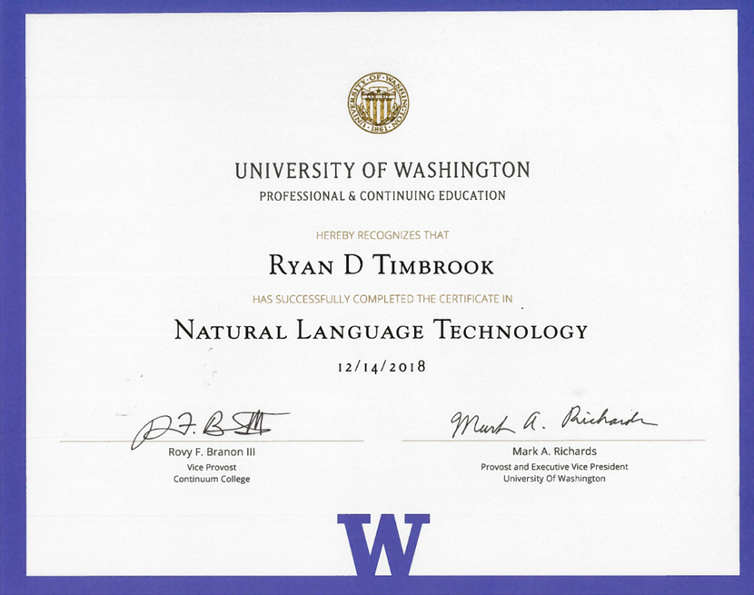

## Ryan Timbrook (Graduate Student - Course Work Repository)
**[LinkedIn Profile](https://www.linkedin.com/in/ryantimbrook/)**

## [University of Washington, Master of Science in Computational Linguistics](https://www.compling.uw.edu/?utm_source=pce.uw.edu&utm_medium=referral&utm_campaign=(not%20set))
### [Certificate in Natural Language Technology](https://www.pce.uw.edu/certificates/natural-language-technology)

#### [LING 571 - Deep Processing Techniques for NLP](https://www.pce.uw.edu/courses/deep-processing-techniques-for-natural-language-processing) - Winter 2017
#### SYLLABUS

                                  **University of Washington, Professional & Continuing Education**
                                         **LING 571 - Deep Processing Techniques for NLP**     

**ABOUT THIS COURSE:**  
Deep linguistic processing aims to extract meaning from natural language text in machine readable form. Deep linguistic processing is useful in applications that require precise identification of the relationships between entities and/or the precise meaning of the author, such as automated customer service response and machine reading for expert systems. Deep linguistic processing is also essential to the creation of natural language dialogue systems, which allow computers to understand and reply in natural language.

This course covers algorithms for using precision grammars to associate deep or elaborated linguistic structures with naturally occurring linguistic data (parsing) and to associate natural language strings with input semantic representations (generation). It also covers associated techniques for disambiguation (parse, generated string) and transfer (for symbolic machine translation).

University of Washington, Masters of Computational Linguistics - LING 571 - Deep Processing Techniques for NLP
